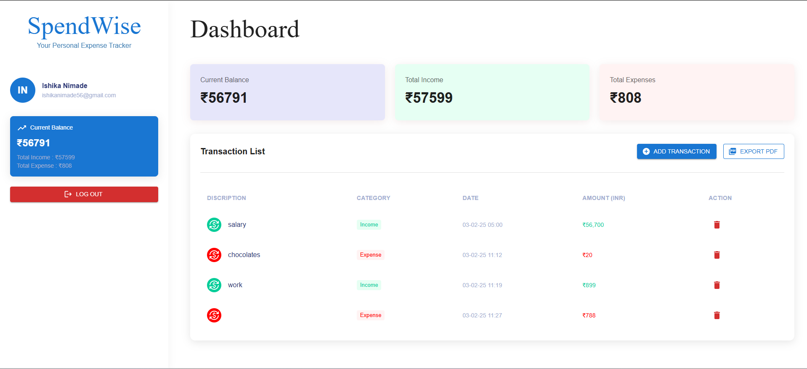
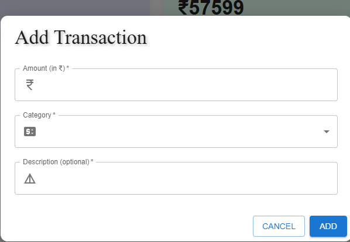
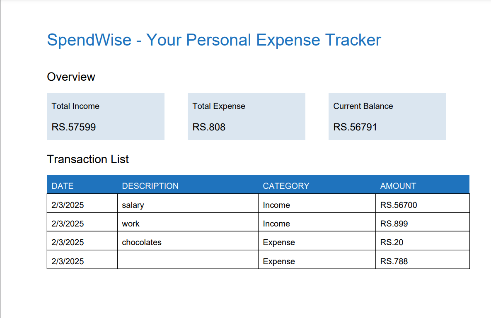

# SpendWise - Your Personal Expense Tracker

An **Expense Tracker** application built with **React.js** for the frontend and **Express.js** for the backend, using **MySQL 8** as the database. This app allows users to manage their expenses, track their income and expenses, and export reports to PDF.

---

## Features

- **User Authentication**: Users can register and log in using email and password.
- **Expense Management**: 
  - Add, edit, and delete expenses.
  - Each expense includes an amount, category (Income/Expense), and an optional description.
  - View a table of all expenses with total income and expenses summarized at the top.
- **Export to PDF**: Users can export their expense report as a PDF.

---

## Tech Stack

### Frontend (Client):

- **React.js** for building the user interface.
- **Material UI** UI components and styling.
- **React Router** for client-side routing.
- **Axios** for making HTTP requests to the backend.
- **JWT** for managing authentication tokens in the frontend.

### Backend (Server):

- **Express.js** (Node.js) for creating the backend server.
- **MySQL 8** for the database to store user and expense data.
- **Sequelize ORM** for interacting with MySQL and simplifying database queries.
- **JWT** for handling user authentication.
- **bcrypt** for hashing passwords securely.

### PDF Export:

- **jsPDF** for generating PDF reports of the expenses.

---

## Project Structure

```
expense-tracker-demo/
│  
├── assets/       # Snapshot of app
│  
├── client/        # Frontend code (React.js)
│   ├── public/
│   ├── src/
│   │   ├── api/
│   │   ├── assets/
│   │   ├── components/
│   │   ├── context/
│   │   ├── hooks/
│   │   ├── layouts/
│   │   ├── pages/
│   │   ├── routes/
│   │   ├── services/ 
│   │   ├── styles/ 
│   │   ├── utils/
│   │   ├── App.js
│   │   └── index.js
│   ├── package.json
│   └── .env
│   
├── server/        # Backend code (Express.js, MySQL, Sequelize)
│   ├── config/     
│   ├── controllers/ 
│   ├── middleware/ 
│   ├── migrations/ 
│   ├── models/      
│   ├── routes/    
│   ├── seeders/ 
│   ├── utils/   
│   ├── server.js    
│   └── .env        
├── README.md       
```

---

## Installation

### Prerequisites

- **Node.js** (version 14 or higher)
- **MySQL 8** (or a cloud-based MySQL instance like Amazon RDS or ClearDB)
- **npm** (Node Package Manager)

### Frontend Setup

1. Navigate to the `client` directory:

   ```bash
   cd client
   ```

2. Install frontend dependencies:

   ```bash
   npm install
   ```

3. Create a `.env` file in the `client` directory and add the backend API URL:

   ```plaintext
   REACT_APP_API_URL=http://localhost:5000
   ```

4. Start the React development server:

   ```bash
   npm start
   ```

   The frontend will be available at `http://localhost:3000`.

### Backend Setup

1. Navigate to the `server` directory:

   ```bash
   cd server
   ```

2. Install backend dependencies:

   ```bash
   npm install
   ```

3. Set up the MySQL database:
   - Ensure you have MySQL 8 running locally or use a cloud MySQL service like Amazon RDS or ClearDB.
   - Create a database and update the `.env` file with your MySQL credentials:

     ```plaintext
     DB_HOST=localhost
     DB_USER=root
     DB_PASSWORD=password
     DB_NAME=expense_tracker
     DB_PORT=3306
     JWT_SECRET=your_jwt_secret_key
     ```

4. Run Sequelize migrations to create the necessary tables:

   ```bash
   npx sequelize-cli db:migrate
   ```

5. Start the backend server:

   ```bash
   node server.js
   ```

   The backend will be available at `http://localhost:5000`.

---

### Environment Variables

Make sure the following environment variables are configured in both the frontend and backend:

#### Backend (.env):

```plaintext
DB_HOST=localhost
DB_USER=root
DB_PASSWORD=password
DB_NAME=expense_tracker
DB_PORT=3306
JWT_SECRET=your_jwt_secret_key
```

#### Frontend (.env):

```plaintext
REACT_APP_API_URL=http://localhost:5000
```

---

## Usage

1. **User Authentication**:
   - Users can register and log in to the app using their email and password.
   - On successful login, users will receive a **JWT token** for session management.

2. **Expense Management**:
   - **Add Expense**: Input the amount, select the category (Income or Expense), and optionally add a description.
   - **View Expenses**: View a list of all expenses with a summary of total income and expenses at the top.
   - **Delete Expense**: Remove an expense by clicking on the delete button next to it.

3. **Export to PDF**:
   - Users can export their expense report as a **PDF file** for download.

---

## Screenshots

 - Here are some screenshots of the Expense Tracker application:

### Authentication:

- Login


- Signup

### Dashboard:

- Dashboard


- Add Expense


### PDF Export:



---

## PDF Export Scalability

The PDF export feature has been implemented to scale efficiently for larger datasets. The export is designed to handle large numbers of rows with optimized rendering, and pagination is used when necessary.

---

## Testing

You can run tests using the following command (if you’ve set up tests):

```bash
npm test
```

---

## Deployment

You can deploy the backend and frontend on platforms like **Heroku**, **DigitalOcean**, **Vercel**, or **Netlify**.

### Backend Deployment (Heroku)

1. Initialize a git repository:

   ```bash
   git init
   git add .
   git commit -m "Initial commit"
   ```

2. Create a Heroku app:

   ```bash
   heroku create expense-tracker-backend
   ```

3. Push to Heroku:

   ```bash
   git push heroku master
   ```

4. Set environment variables on Heroku:

   ```bash
   heroku config:set DB_HOST=your-database-host DB_USER=your-db-user DB_PASSWORD=your-db-password DB_NAME=your-db-name JWT_SECRET=your-jwt-secret-key
   ```

5. Open the deployed app:

   ```bash
   heroku open
   ```

### Frontend Deployment (Vercel)

1. Deploy the frontend to **Vercel**:

   - Sign up for Vercel and link your repository.
   - Follow the deployment instructions on the Vercel dashboard.

---

## Code Quality and Best Practices

- **Modular Code**: The app is organized with separate components, services, and routes to promote reusability and maintainability.
- **Error Handling**: The backend has proper error handling for edge cases such as invalid input, failed authentication, and database issues.
- **Security**: Passwords are securely hashed using **bcrypt**, and authentication is handled with **JWT tokens**.

---
